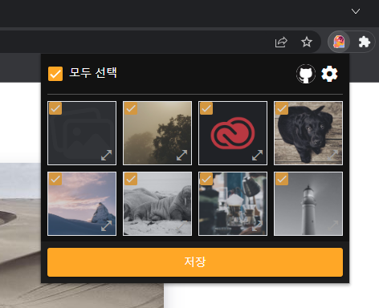

# 현재 페이지의 모든 이미지를 저장하세요!
[english](https://github.com/kkan0615/image-downloader-chrome-extention/blob/main/README.md)
<br>
아직 스토어에 등록하지 않았습니다 ㅠㅠ <br>
빠른시일내에 등록하도록 하겠습니다.

## Screenshots
 <br>
Screenshot 1

## Tech stack
1. Vue 3
2. Typescript
3. Vite

## Download

## Local 환경에서 설치
### Clone from github
```
git clone https://github.com/kkan0615/image-downloader-chrome-extention.git
```
### 코드 빌드
```bash
npm run build # npm
yarn run build # yarn
```
### 크롬 확장프로그램 페이지로 이동
<a href="chrome://extensions/"> move to extensions </a>

### 개발자 모드 ON

###  the Load unpacked 버튼 클릭.

### 우측 상단에서 사용해보세요!

## 후원하기
<a href="https://www.buymeacoffee.com/youngjinkwak" target="_blank"></a>

## Todo list
1. Display Error message to user
2. Publish on chrome store
3. Change readme.md
4. Proxy ... ?
