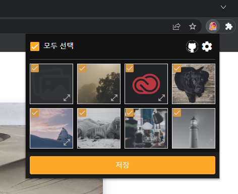

# Download all the images on the web page!
[한국어](https://github.com/kkan0615/image-downloader-chrome-extention/blob/main/README.ko.md)
<br>
There is no link for store yet

## Screenshots
 <br>
Screenshot 1

## Tech stack
1. Vue 3
2. Typescript
3. Vite

## Download

## How to use - local
### Clone from github
```
git clone https://github.com/kkan0615/image-downloader-chrome-extention.git
```
### Build the code
```bash
npm run build # npm
yarn run build # yarn
```
### Move to following link
<a href="chrome://extensions/"> move to extensions </a>

### Able the developer mode

### Press the Load unpacked.

### Done!!

## Support me!
<a href="https://www.buymeacoffee.com/youngjinkwak" target="_blank"></a>

## Todo list
1. Display Error message to user
2. Publish on chrome store
3. Change readme.md
4. Proxy ... ?
